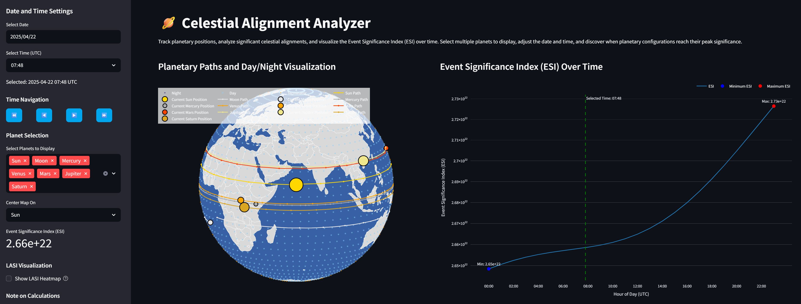

# 🪐 Celestial Alignment Analyzer

[](https://www.python.org/downloads/)
[](https://streamlit.io/)
[](https://opensource.org/licenses/MIT)

An interactive web application that tracks planetary positions, analyzes significant celestial alignments, and visualizes both the Event Significance Index (ESI) and Local Alignment Significance Index (LASI) over time. Monitor multiple celestial bodies (Sun, Moon, Mercury, Venus, Mars, Jupiter, Saturn, Uranus, Neptune, Pluto, Ceres) simultaneously, discover when planetary configurations reach their peak significance, and explore how these alignments change throughout the day and across extended time periods. The LASI heatmap feature allows you to identify locations on Earth where celestial alignments appear most significant from an observer's perspective.

[Live Demo](https://planetarypath.streamlit.app) <!-- Visit the deployed app here -->

 <!-- Screenshot of the Celestial Alignment Analyzer app -->

## ✨ Features

- 🪐 Multiple planet visualization (Sun, Moon, Mercury, Venus, Mars, Jupiter, Saturn, Uranus, Neptune, Pluto, Ceres)
- 📊 Event Significance Index (ESI) analysis that quantifies planetary alignment significance based on proximity, mass, and distance
- 📈 Daily ESI variation chart showing how alignment significance changes throughout the selected day
- 📉 Date range ESI analysis with customizable time window (up to 60 days before/after)
- 🌍 Real-time planet position visualization on an interactive 3D globe
- 🛣️ 24-hour planet path prediction
- 🌓 Dynamic day/night terminator display
- 🔍 Local Alignment Significance Index (LASI) heatmap showing location-specific alignment significance
- 📅 Interactive date and time selection
- ⏪⏩ Time navigation buttons for easy time adjustment
- 🌐 Global orthographic projection with zoom and pan
- 🕒 UTC time support
- 🗺️ Country borders and coastlines

## 🚀 Quick Start

### Prerequisites

- Python 3.7 or higher
- pip (Python package installer)

### Installation

1. Clone this repository:
```bash
git clone https://github.com/kongpop10/celestial-align.git
cd celestial-align
```

2. Create and activate a virtual environment (recommended):
```bash
# Windows
python -m venv venv
venv\Scripts\activate

# macOS/Linux
python3 -m venv venv
source venv/bin/activate
```

3. Install the required packages:
```bash
pip install -r requirements.txt
```

### Running the App

1. Start the Streamlit server:
```bash
streamlit run app.py
```

2. Open your web browser and navigate to:
```
http://localhost:8501
```

## 🎯 How to Use

1. **Planet Selection**: Choose multiple celestial bodies to visualize simultaneously
2. **Date Selection**: Use the sidebar date picker to choose any date
3. **Time Selection**: Select the time in UTC using the time picker
4. **Time Navigation**: Use the navigation buttons to adjust time:
   - ⏪ Fast backward: Go back 1 hour
   - ◀️ Backward: Go back 15 minutes
   - ▶️ Forward: Go forward 15 minutes
   - ⏩ Fast forward: Go forward 1 hour
5. **Visualization**:
   - Colored lines show each planet's 24-hour path
   - Larger markers indicate current planet positions
   - Light blue areas represent daylight regions
   - Dark blue areas show night regions
   - Orange line represents the dawn/dusk terminator
6. **ESI Analysis**:
   - View the Event Significance Index for the current planetary configuration
   - Explore how ESI changes throughout the day with the daily chart
   - Analyze ESI variations across a customizable date range
   - Identify peak alignment periods with minimum/maximum ESI markers
7. **LASI Visualization**:
   - Enable the LASI heatmap in the sidebar to see location-specific alignment significance
   - Adjust grid resolution and marker size to customize the visualization
   - The red star marks the location with maximum LASI value
   - Hover over points to see exact LASI values for different locations

## 🔧 Technical Details

### Visualization Components
- **Planet Selection**: Choose from Sun, Moon, Mercury, Venus, Mars, Jupiter, Saturn, Uranus, Neptune, Pluto, and Ceres (dwarf planet)
- **Planet Position**: Shows where planets are directly overhead
- **Path Tracking**: 24-hour prediction with hourly points
- **Day/Night Display**: Real-time calculation of Earth's illumination
- **Terminator Line**: Accurate dawn/dusk boundary visualization
- **Time Navigation**: Intuitive buttons for adjusting time in different increments

### Analysis Components
- **Event Significance Index (ESI)**: Mathematical model quantifying planetary alignment significance globally
- **Local Alignment Significance Index (LASI)**: Location-specific alignment significance measurement
- **Daily ESI Chart**: Spline visualization of ESI changes throughout the selected day
- **Date Range ESI Chart**: Extended analysis of ESI variations across a customizable time period
- **Min/Max Indicators**: Markers highlighting the most and least significant alignment periods
- **LASI Heatmap**: Global visualization showing where alignments appear most significant from different Earth locations

### Technologies Used
- **Streamlit**: Web application framework
- **Plotly**: Interactive visualization
- **ephem**: Astronomical calculations
- **NumPy/Pandas**: Data processing
- **pytz**: Timezone handling

## 📝 Notes

- All astronomical calculations are approximations suitable for visualization
- Times are displayed in UTC (Coordinated Universal Time)
- Position calculations show where planets are directly overhead
- Visualization accuracy is optimized for general use
- The LASI (Local Alignment Significance Index) measures how significant a celestial alignment appears from specific locations on Earth
- LASI considers both the angular separation between celestial bodies as seen from each location and the mass-distance relationship of each body
- Higher LASI values indicate locations where the selected celestial bodies appear more closely aligned in the sky

## 📚 Documentation

Detailed documentation is available in the project:

- [ESI Documentation](ESI_documentation.md): Details on the Event Significance Index calculation
- [LASI Documentation](docs/LASI.md): Details on the Local Alignment Significance Index calculation
- [GESI Documentation](docs/GESI.md): Details on the Ground-Based Event Significance Index

## 🤝 Contributing

Contributions are welcome! Please feel free to submit a Pull Request.

1. Fork the repository
2. Create your feature branch (`git checkout -b feature/AmazingFeature`)
3. Commit your changes (`git commit -m 'Add some AmazingFeature'`)
4. Push to the branch (`git push origin feature/AmazingFeature`)
5. Open a Pull Request

## 📄 License

This project is licensed under the MIT License - see the [LICENSE](LICENSE) file for details.

## 👏 Acknowledgments

- [Streamlit](https://streamlit.io/) for the amazing web app framework
- [ephem](https://rhodesmill.org/pyephem/) for astronomical calculations
- [Plotly](https://plotly.com/) for interactive visualizations

## 📧 Contact

kongpop10 - kongpopu@outlook.com

Project Link: [https://github.com/kongpop10/celestial-align](https://github.com/kongpop10/celestial-align)
